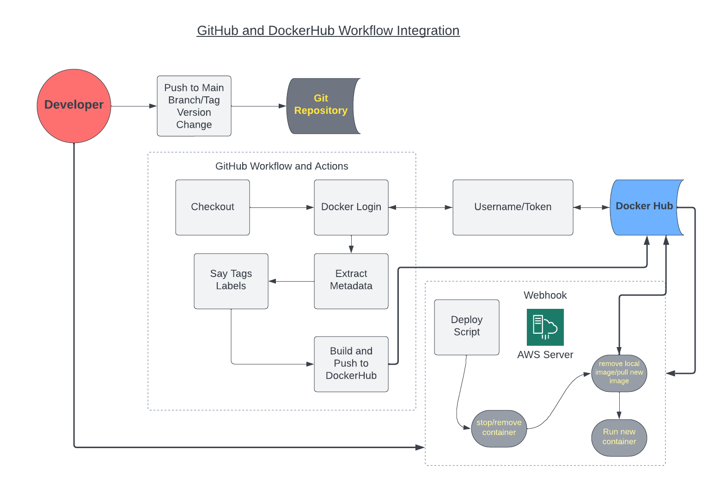

# CEG3120 - Project 5 Repo
- This is a repository for Michael McCain's Project 5 milestones

Docker Repo: [Mechree's Docker Repository](https://hub.docker.com/repository/docker/mechree/ceg3120-images/general "Docker Repository Link")

# Project Overview
- The purpose of this project to is to become familair with creating and utilizing containers using the software Docker Desktop on the command line, implementing and practice versioning, the use of webhooks, and AWS.



## GitHub Tags
- to push a tag use the command in your repo `git push origin <tag>`
- to generate a tag on the current branch use `git tag <tagname>`. To do the same with an annotation use `git tag -a <tagname> -m "Message"`

**_NOTE_** You must must push your tags after creating them on your local version of the repo. 

## Workflow Process/Behavior
- On push/pull to main GitHub branch or version change
	* Login to DockerHub using defined username/password GitHub Secrets
	* Extract tags from the repository
	* build and push the image to DockerHub with extracted tags and labels

## How to install Docker
- `sudo yum install -y docker`
- `sudo usermod -a -G docker ec2-user`
- `id ec2-user`
- `newgrp docker`

## Container Restart Script
- The container restart script will stop the active container, remove the container and the image, and then pull, and run the updated images from DockerHub. 
- It is used for automating the process of updating a Docker container when a new version of an image is released.
- This script can be located in an easily identifiable folder titled "Scripts" or in the home directory, but for this project it is located in '/home/ec2-user/webhooks/my-site'. 

## Setting up a webhook
### Installing Adnah's Webhooks
```
sudo yum install -y golang
echo 'export GOPATH=$HOME/go' >> ~/.bash_profile
echo 'export PATH=$PATH:$GOROOT/bin:$GOPATH/bin' >> ~/.bash_profile
source ~/.bash_profile
go install github.com/adnanh/webhook:latest
mkdir ~/webhooks
cd webhooks
touch hooks.json
```
### How to Start the Webhooks
- `webhook -hooks /path/to/your/hooks.json -verbose`
- To ensure a webhook is automatically restarted after a system restart create a webhooks.service file.

### What is a webhook?
- A webhook is a "listener" program that uses http communication to trigger events and execute defined commands on the server running it. 
- On my AWS linux system the webhook folder location is in `/home/ec2-user/webhooks`

### Dockerhub Webhook Setup
- Go to the your repository on DockerHub's website.
- Click the "Webooks" tab
- Name the webhook and enter the url (ip:port/hooks/webhook)
- The hooks.json file should look like this:
```
[
  {
    "id": "webhook",
    "execute-command": "/home/ec2-user/webhooks/my-site/deploy.sh",
    "command-working-directory": "/home/ec2-user/go",
    "response-message": "Executing deploy script..."
  }
]
```
- The above hooks.json file is naming the webhook, execuing the deploy.sh script, using the "go" directory, and displaying a message in the browser that it is executing.
- For the purpose of this project the location of this file is in `/home/ec2-user/webhooks/my-site`

