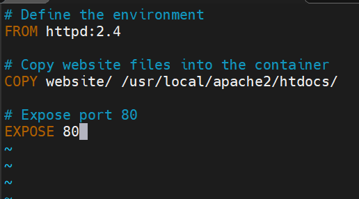

# CEG3120 - Project 4 Repo
- This is a repository for Michael McCain's Project 4 milestones

Docker Repo: [Mechree's Docker Repository](https://hub.docker.com/repository/docker/mechree/ceg3120-images/general "Docker Repository Link")

# Project Overview
- The purpose of this project to is to become familair with creating and utilizing containers using the software Docker Desktop on the command line, implementing and practice versioning, and to use webhooks.

# Docker Setup and Usage Guide on Windows Subsystem for Linux 2 (WSL2)

## Installing Docker and Dependencies on WSL2

**Install Docker on WSL Linux Distribution**:
	- Download and install the latest version of Docker Desktop for Windows.

	- Follow the usual installation instructions to install Docker Desktop. Depending on which version of Windows you are using, Docker Desktop may prompt you to turn on WSL 2 during installation. Read the information displayed on the screen and turn on the WSL 2 feature to continue.

	- Start Docker Desktop from the Windows Start menu.

	- Navigate to Settings.

	- From the General tab, select Use WSL 2-based engine...

	- If you have installed Docker Desktop on a system that supports WSL 2, this option is turned on by default.
	
	- Select Apply & Restart.
	
Guide: [Docker WSL Install](https://docs.docker.com/desktop/wsl/)

## Building a Docker Image from a Dockerfile

1. **Create a Dockerfile**:
    - Create a file named `Dockerfile` in your project directory.
    - Define your environment in the Dockerfile (e.g., `FROM python:3.8`, `COPY . /app`).
	

2. **Build the Docker Image**:
    - Navigate to your project directory in the Linux distribution.
    - Run: `docker build -t container-name:tag .`

## Running a Docker Container

1. **Run the Docker Container**:
    - Run the container: `docker run -dit --name desired-name -p 80:80 container-name`

**_NOTE:_** Host Port comes first, then Container Port

## Viewing the Project Running in the Container

1. **Access the Application**:
    - Open a web browser and go to `http://localhost:80` (or the respective IP and port your app is running on).
	- curl localhost

# Milestone 2: Git Secrets and Workflow, Dockerhub Repo and Credentials

## Guide to Creating a Public Repository on DockerHub

### Prerequisites

1. A DockerHub Account
2. Docker Installed on your device.

### Step 1: Log In to DockerHub

1. Go to [DockerHub](https://hub.docker.com/).
2. Click on **Log in** in the top right corner.
3. Enter your Docker ID and password, and click **Sign In**.

### Step 2: Create a New Repository

1. Once logged in, click on **Create Repository** on the right side of the dashboard.
2. Choose a name for your repository. This name must be unique on DockerHub.
3. Add a short description for your repository.
4. Select desired visibility **Private** or **Public**
5. Click **Create**.

### Step 3: Push an Image to Your Repository

**Pushing an Image**
1. Name your local image using your Docker ID and the repository name that you created.

**_NOTE:_** To add multiple images, add a specific :<tag> to them, for example docs/base:testing. If it's not specified, the tag defaults to latest.

- **Name your local images using one of these methods:**
	* When you build them, using `docker build -t <hub-user>/<repo-name>[:<tag>]`
	* By re-tagging the existing local image with `docker tag <existing-image> <hub-user>/<repo-name>[:<tag>]`
			
	* By using `docker commit <existing-container> <hub-user>/<repo-name>[:<tag>]` to commit changes.
		
2. Then, you can push this image to the repository designated by its name or tag:
	* `docker push <hub-user>/<repo-name>:<tag>`
### Step 4: Verify the Repository

1. Go back to your DockerHub account.
2. Click on **Repositories** to see your newly created repository.
3. Click on the repository name to view the details and ensure your image is listed there.

DH New Repo and Push Guide: [DH Repo Guide](https://docs.docker.com/docker-hub/repos/create/)

## Pushing a Container Image to DockerHub

### Step 1: Login using CLI and Tokens
- Use the command line to login into docker with `docker login`. Follow the prompts to enter a username and password. 

**_NOTE:_** Set the correct privileges for the user via the command `sudo usermod -aG docker USERNAME`

- Alternatively a DockerHub token can be used `docker login --username YOUR_USERNAME`
- At the password prompt enter the token information instead.

Dockerhub Token Guide: [DH Tokens](https://docs.docker.com/security/for-developers/access-tokens/)

### Step 2: Tag the Docker Image
- `docker tag <local-image>:<tag> <dockerhub-username>/<repository-name>:<tag>`

### Step 3: Push Image to DockerHub
- `docker push <dockerhub-username>/<repository-name>:<tag>`

## Configuring GitHub Secrets

### Secrets for this Guide
1. **Docker_Username:** contains the username for the dockerhub login.
2. **Docker_Password:** contains the password for the associated dockerhub username

### How to Configure a Secret
1. Navigate to the repository.
2. Click settings in the top right of the github tool bar and select **settings**
.
3. On the left, scroll down to **security** open up **Secrets and variables** and select **Actions**.
4. Select **New repository secret** which is displayed to the right of the **Repository Secrets** section.
5. From there, fill out the desired name and secret information.

 

GitHub Secrets Guide: [GitSecrets](https://docs.github.com/en/actions/security-guides/using-secrets-in-github-actions)
## GitHub Tags ##
- to push a tag use the command in your repo 'git push origin <tag>'
- to generate a tag on the current branch use 'git tag <tagname>'. To do the same with an annotation use 'git tag -a <tagname> -m "Message"'
**_NOTE_** You must must push your tags after creating them on your local version of the repo. 

## Behavior of Github Workflow

Workflow Docker Guide: [Build/Push DockerHub Guide](https://github.com/marketplace/actions/build-and-push-docker-images)

Managing Tags w/ Docker Guide: [Docker Tags Guide](https://docs.docker.com/build/ci/github-actions/manage-tags-labels/)

### Purpose
- The purpose of GitHub Workflows is to automate the development process and eliminate tedious tasks among a development team. 
- A workflow will use a group of defined **Actions** to perform a defined task when an **event** is triggered. 
- The workflow for this project will automate the process of pushing an image to my public DockerHub repository when I push/pull to the main branch of my GitHub repository or update the version. 

**_Workflow Process/Behavior_**
- On push/pull to main GitHub branch or version change
	* Login to DockerHub using defined username/password GitHub Secrets
	* Extract tags from the repository
	* build and push the image to DockerHub with extracted tags and labels

### Custom Variables
- Some of the custom variables that would need to be edited if others were to reuse the file are:
	* Docker Username and Docker Password secrets
	* Defined Docker Namespace and Repository
	* Latest version of OS that the project runs on

# Diagram of GitHub Workflow and Actions with DockerHub

